# 최보람 — 소모임 가입 유저 플로우 (임시 초안)

> 임시 작업 파일입니다. 사용자가 제시한 참고 흐름(문토 현재 가입 플로우, Figma
> `jMx6ZzITwZJAeaiVee9xsG` 노드 `265:223`)의 구조 — 화면(파랑)·확인 행동(초록)·판단 분기(빨강 다이아몬드)·시스템 처리
> 상태(보라)·이탈(회색)을 한 그래프에서 이어 그리는 방식 — 을 그대로 따릅니다. 참고 흐름의 개별 노드(참가비 분기,
> 승인제 클럽 분기, 채팅방 자동 생성 등)는 문토 화면에서 확인된 것이며 소모임 화면에서 확인된 적이 없으므로 그대로
> 옮기지 않았습니다. 대신 "모임 상세 확인 → 가입할까?" 구간에 최보람 시나리오의 판단 기준을 실제 소모임 화면
> ([`ia-somoim-current-state-draft.md`](ia-somoim-current-state-draft.md) SM 번호)에 대입해 끼워 넣었습니다.

## 근거

- 화면 구조: `ia-somoim-current-state-draft.md`의 SM-01, SM-03~SM-16
- 판단 기준: 최보람 시나리오 원문(사용자 제공) — 위치·일정·비용, 실제 참여 규모, 게임 수준/종류, 참여자 연령대, 신규 회원이 어울리는 방식, 술자리·뒤풀이 회피, 무진행 방치 부담
- 소개 텍스트 원문: `research/data/current_state/screenshots/somoim/sm-03-flipboardgame-club-detail.jpeg` 확대 재확인

## 유저 플로우 (Mermaid)

> 파랑 = 실제 화면. 초록 = 그 화면에서 보람이 하는 확인 행동. 빨강 다이아몬드 = 판단 분기. 보라 = 시스템 처리 상태.
> 회색 = 이탈. 주황 점선 = 화면을 끝까지 봐도 확인되지 않는 정보 공백이거나, 소모임에서 확인되지 않은 이후 절차.

```mermaid
flowchart LR
    Enter["앱 진입"]:::screen
    Home["홈<br/>SM-01"]:::screen
    Enter --> Home

    ListMerge["모임 목록<br/>(카테고리 결과/더보기 목록 공통)"]:::screen

    Home -->|카테고리| CatScreen["카테고리 상세 화면<br/>SM-06"]:::screen
    CatScreen -->|소분류 필터 선택| ListMerge
    Home -->|검색| SearchEntry["검색 엔트리 화면<br/>최근 검색어·추천 검색어·카테고리 아이콘<br/>SM-15"]:::screen
    SearchEntry -->|검색어 입력| SearchResult["검색 결과 화면<br/>쿼리+'키워드 알림 받기' CTA<br/>카드 형식은 다른 목록과 동일<br/>SM-16"]:::screen
    SearchResult --> ListMerge
    Home -->|홈 섹션 더보기<br/>예: 활동이 활발한 모임 등 8개| MoreScreen["더보기 목록 화면<br/>SM-07~SM-14"]:::screen
    MoreScreen --> ListMerge
    Home -->|홈의 모임 카드 직접 선택| Detail
    ListMerge -->|모임 선택| Detail["모임 상세<br/>예: (관악/동작/서초) 플립보드게임<br/>SM-03"]:::screen

    Detail --> DetailCheck["모임 상세 확인<br/>홈 탭: 소개 텍스트·정기모임 목록·멤버 목록"]:::screen

    DetailCheck --> StyleCheck{"소개 텍스트로<br/>진행 방식 확인<br/>(술자리 중심? 무진행 방치형?)"}
    StyleCheck -->|회피 조건과 일치하는 후보| BackToList["다른 후보 비교"]:::grayEnd
    BackToList --> ListMerge
    StyleCheck -->|"실제 문구: 전략게임은 원하는 분<br/>있을 때만 진행 · 뒷풀이는 원하는<br/>사람만(과음 자제 요청)<br/>→ 게임 중심, 회피 조건과 다름"| ScheduleAction["정기모임 목록에서<br/>개별 일정·비용·참석 인원 확인<br/>예: 8.13(목) 19:00·6,000원+음료비·7명(7/20)"]:::action

    ScheduleAction --> BoardAction["게시판 탭 이동<br/>가입인사·공지 확인<br/>SM-05"]:::action
    BoardAction --> PhotoAction["사진첩 탭 이동<br/>실제 플레이 사진 확인<br/>SM-04"]:::action

    PhotoAction --> GapCheck["연령대: 전혀 확인 안 됨<br/>참여 규모: 전체 멤버 179명 vs<br/>정모별 참석 4~20명, 기준 모호<br/>신규 회원 어울리는 방식: '환영'만 있고<br/>구체적 방식 서술 없음"]:::gap

    GapCheck --> JoinDecide{"확인된 조건과<br/>공백을 종합했을 때<br/>가입할까?"}
    JoinDecide -->|아니오: 연령·구체적<br/>진행 방식이 끝내 걸림| Churn["이탈"]:::grayEnd
    JoinDecide -->|예: 확인된 조건으로<br/>충분하다고 판단| JoinButton["모임 가입하기 버튼 탭<br/>SM-03 하단 고정 버튼"]:::action
    JoinButton --> JoinDone["가입완료"]:::state
    JoinDone -.->|참가비·승인 대기·채팅방 자동 생성<br/>등 이후 절차가 소모임에도 있는지<br/>이번 캡처로는 미확인| Unknown["?"]:::gap

    classDef screen fill:#dbeafe,stroke:#2563eb,color:#1e3a8a;
    classDef action fill:#dcfce7,stroke:#16a34a,color:#14532d;
    classDef state fill:#ede9fe,stroke:#7c3aed,color:#3730a3;
    classDef grayEnd fill:#f3f4f6,stroke:#6b7280,color:#374151;
    classDef gap fill:#fff7ed,stroke:#ea580c,color:#7c2d12,stroke-dasharray: 4 2;
    class StyleCheck,JoinDecide screen;
```

## 관찰 메모

- 참고 흐름(문토)은 "모임 상세 확인" 다음이 바로 "가입할까?" 한 번의 예/아니오 분기지만, 이번 소모임 흐름은 그 사이에 보람의 실제 판단 과정(진행 방식 확인 → 일정/비용/참석 인원 확인 → 게시판 확인 → 사진첩 확인 → 정보 공백 인지)을 끼워 넣었습니다. 문토 화면에도 이 정도 세부 판단 단계가 실제로 존재하는지는 이번 작업 범위 밖이라 비교하지 않았습니다.
- 참고 흐름의 참가비 분기·승인제 클럽 분기·채팅방 자동 생성·마이페이지 모임내역·대기 취소·탈퇴 등은 모두 문토 화면(CS 번호)에서 확인된 내용이며, 소모임 화면에서는 한 번도 확인되지 않았습니다. 그대로 옮기면 사실이 아닌 것을 사실처럼 그리는 것이 되어 포함하지 않았고, `가입완료` 이후는 점선으로 "미확인" 처리했습니다. 소모임에 실제로 참가비·승인 대기 절차가 있는지 확인하려면 해당 화면 캡처가 추가로 필요합니다.
- 이 예시(플립보드게임)에서는 게임 성향·뒷풀이 비중은 소개 텍스트로 확인되지만, 연령대는 전혀 확인되지 않고 참여 규모는 서로 다른 두 수치(전체 멤버 179명 vs 정모별 참석 4~20명)가 있어 기준이 모호하며, 신규 회원이 실제로 어떻게 어울리는지는 "환영한다"는 태도만 있을 뿐 구체적 방식이 없습니다.
- 마지막 `가입할까?` 분기는 시나리오도 화면도 결말을 확정하지 않습니다. 이 문서가 흐름을 완결하기 위해 만든 두 가지 가능한 다음 행동입니다.
- 검색 경로(SM-15·SM-16)를 확인해 이전 버전의 "검색, 목적지 미확인" 점선을 실선으로 수정했습니다. 검색 결과 카드는 다른 목록 화면과 같은 형식이라 `모임 목록` 병합 노드로 그대로 합류시켰습니다.
